

  

<h1 align="center">PayNow dla Shopware 6 — instrukcja konfiguracji</h1>

Bramka płatności PayNow — krok po kroku: od danych z panelu PayNow po gotowe płatności w sklepie.

---

> ℹ️ Instalację wtyczki (Composer lub ZIP) opisuje **[Instrukcja instalacji](instalacja.md)**. Ten dokument zakłada, że wtyczka jest już zainstalowana i aktywna.

---

## Zanim zaczniesz

Potrzebujesz:

- **aktywnego konta PayNow** z dostępem do kluczy API (do płatności produkcyjnych) lub **konta sandbox** (do testów),
- sklepu Shopware z kanałem sprzedaży obsługującym walutę **PLN**,
- zainstalowanej i aktywnej wtyczki **Bramka płatności PayNow**.

> 💡 **Najpierw testy.** Zalecamy skonfigurowanie i przetestowanie płatności na danych **sandbox**, a dopiero potem przełączenie na produkcję.

---

## Krok 1 — Pobierz dane z panelu PayNow

Zaloguj się do panelu PayNow ([panel produkcyjny](https://panel.paynow.pl/) lub [panel sandbox](https://panel.sandbox.paynow.pl/)) i zbierz dwie wartości. Obie znajdziesz w ustawieniach sklepu — poniżej dokładna ścieżka.

### 1a. Klucz API i Klucz obliczania podpisu

Panel PayNow → **Ustawienia → Sklepy i punkty płatności** → wybierz swój sklep. W szczegółach sklepu znajdziesz:

- **Klucz API** (`Api-Key`) — identyfikuje sklep w żądaniach do PayNow,
- **Klucz obliczania podpisu** (klucz do podpisu) — służy do wyliczania podpisu HMAC żądań i **weryfikacji powiadomień** (webhooków) o statusie płatności.

Skopiuj obie wartości. Jeśli nie masz jeszcze kluczy, wygeneruj je w panelu PayNow.

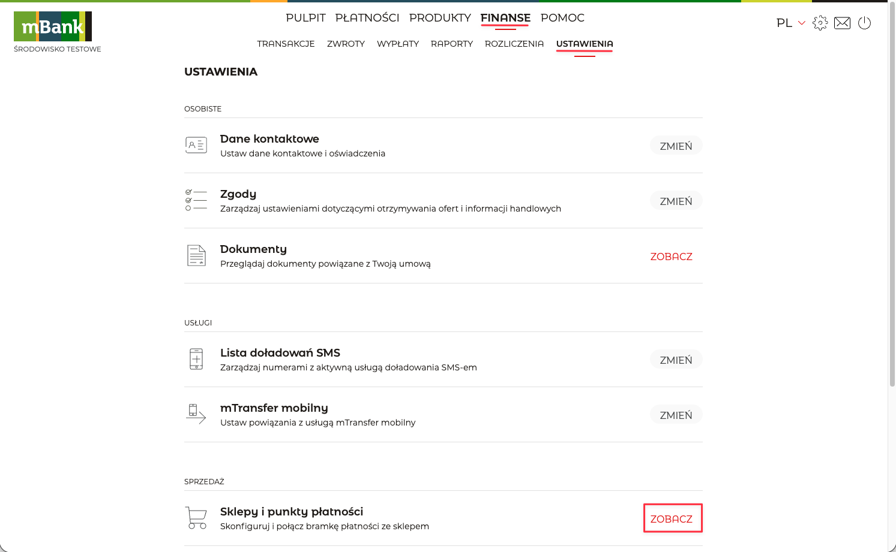

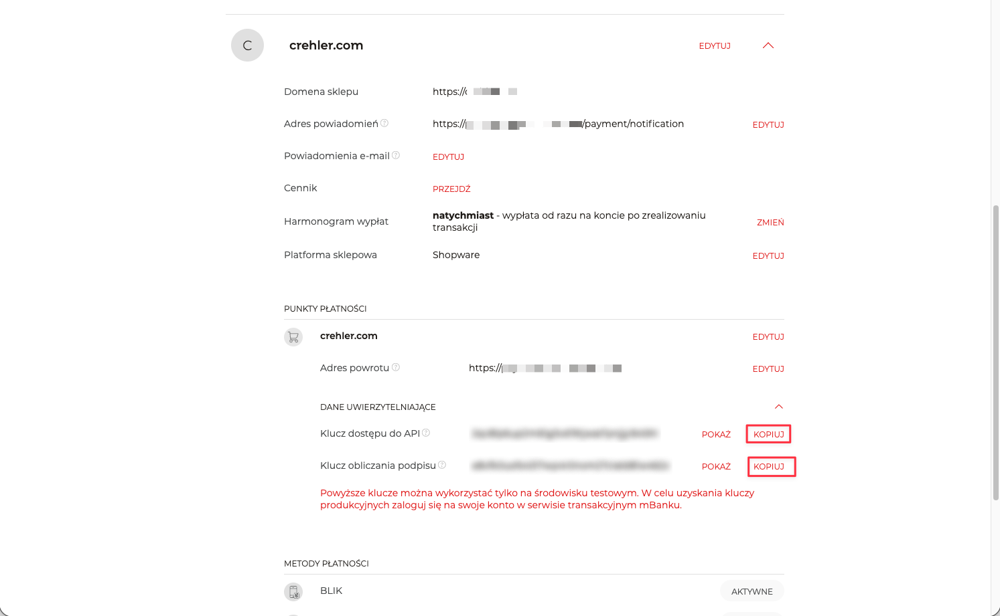

> ⚠️ **Klucz obliczania podpisu jest wymagany.** Powiadomienia PayNow o statusie płatności są weryfikowane podpisem wyliczanym tym kluczem. Bez poprawnego klucza potwierdzenia płatności są odrzucane, a zamówienia pozostają nieopłacone.

> 🧪 **Sandbox:** ten sam ekran istnieje w [panelu sandbox PayNow](https://panel.sandbox.paynow.pl/) i daje osobne wartości (Klucz API / Klucz obliczania podpisu). Wpisuje się je w osobną kartę „Dane sandbox" w konfiguracji wtyczki.

---

## Krok 2 — Wpisz dane w konfiguracji wtyczki

W panelu Shopware przejdź do **Rozszerzenia → Moje rozszerzenia**, znajdź **Bramka płatności PayNow** (musi być włączona — przełącznik po lewej) i kliknij **„Skonfiguruj"**.

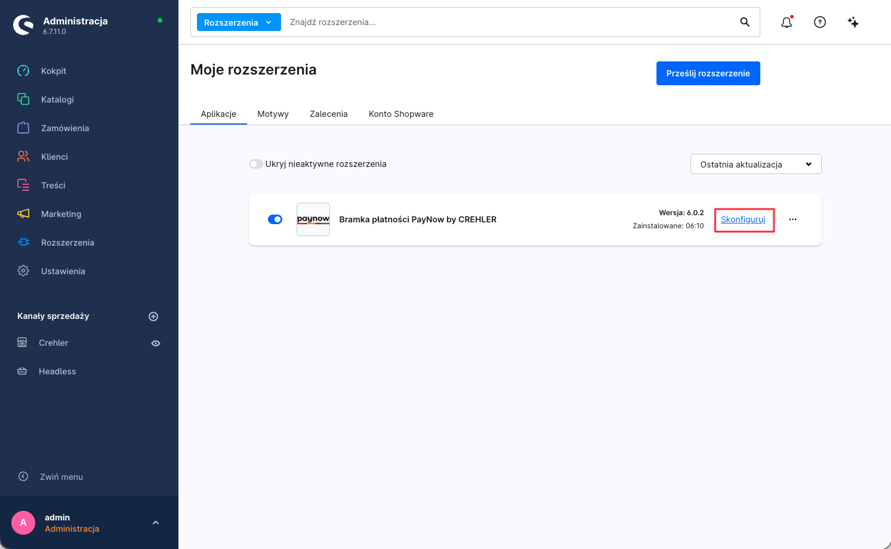

### 2a. Dane produkcyjne

Wypełnij kartę **Dane produkcyjne** wartościami z **Kroku 1**:

| Pole w konfiguracji | Wartość z panelu PayNow |
|---|---|
| **Klucz dostępu do API** | Klucz API (`Api-Key`) |
| **Klucz obliczania podpisu** | Klucz obliczania podpisu (klucz do podpisu) |

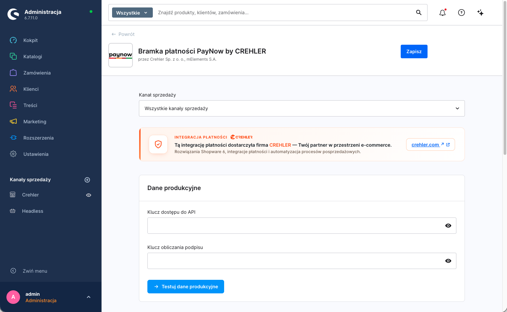

> ⚠️ **Wybór kanału sprzedaży.** U góry konfiguracji znajduje się przełącznik kanału sprzedaży. Ustawienia możesz zapisać globalnie („Wszystkie kanały sprzedaży") lub osobno dla wybranego kanału. Jeśli korzystasz z kilku kanałów z różnymi sklepami PayNow — ustaw dane per kanał.

> 🛑 **Test połączenia NIE zapisuje danych!** Przycisk testu pod kartą jedynie sprawdza poprawność wpisanych kluczy — **nie zapisuje ich**. Aby zachować dane, po teście **osobno kliknij „Zapisz"** (prawy górny róg). Wyjście lub odświeżenie konfiguracji bez zapisania spowoduje utratę wpisanych danych.

### 2b. Dane sandbox (do testów)

Aby płacić na koncie testowym, włącz **Tryb sandbox** i wypełnij kartę **Dane sandbox** danymi z [panelu sandbox PayNow](https://panel.sandbox.paynow.pl/). Gdy tryb sandbox jest włączony, wtyczka używa danych sandbox zamiast produkcyjnych.

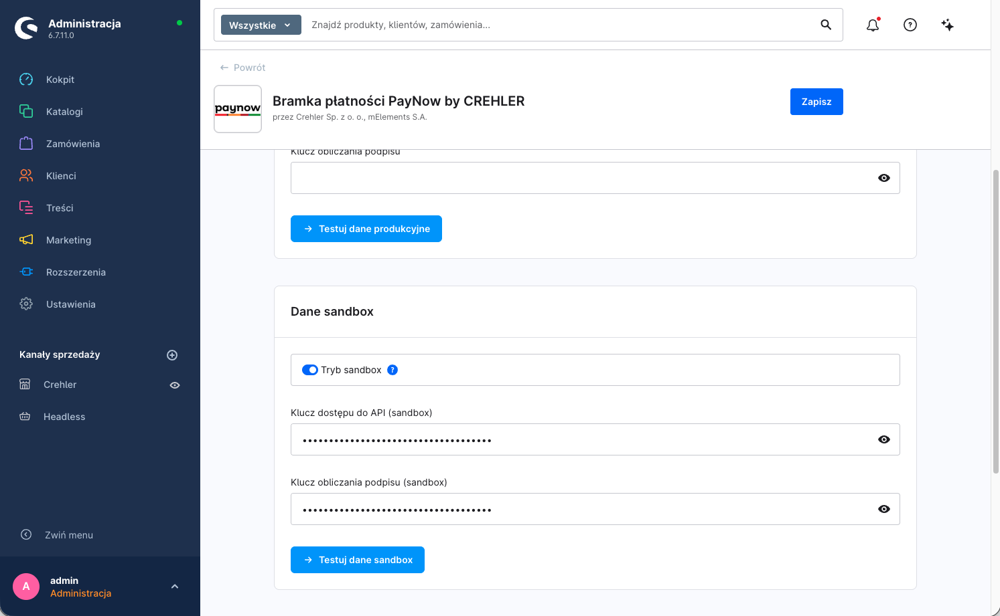

> 🛑 **Test połączenia NIE zapisuje danych!** Tak samo jak przy danych produkcyjnych — przycisk testu tylko weryfikuje klucze sandbox. Aby je zachować, po teście **osobno kliknij „Zapisz"** (prawy górny róg).

### 2c. Przetestuj dane

Pod każdą kartą znajduje się przycisk testu połączenia. Kliknij go po wpisaniu danych — wtyczka połączy się z PayNow i potwierdzi, że klucze są poprawne.

> 🛑 **Pamiętaj: test to nie zapis.** Kliknięcie przycisku testu **nie zapisuje** wpisanych danych — sprawdza je tylko. Dopiero **„Zapisz"** (prawy górny róg) utrwala konfigurację. Wykonaj zapis osobno po udanym teście, zarówno dla danych produkcyjnych, jak i sandbox.

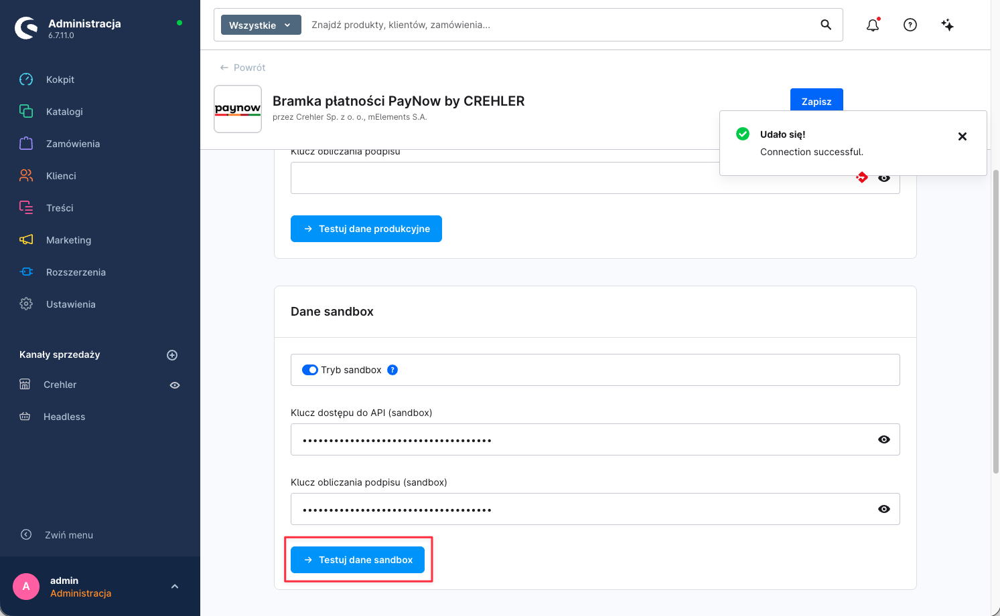

---

## Krok 3 — Uzupełnij adresy w panelu PayNow

PayNow musi wiedzieć, **dokąd wysyłać powiadomienia** o statusie płatności i **dokąd wraca klient** po płatności. Oba adresy wtyczka **wylicza automatycznie** na podstawie adresu Twojego sklepu i pokazuje w konfiguracji wtyczki w karcie **„Adresy do panelu PayNow"** (na górze konfiguracji) — jako pola tylko do odczytu, z przyciskiem **„Kopiuj"**.

| Adres | Wartość (przykład) | Gdzie wkleić w panelu PayNow |
|---|---|---|
| **Adres powiadomień (notyfikacji)** | `https://twoj-sklep.pl/payment/notification` | pole adresu powiadomień / webhooka w konfiguracji sklepu |
| **Adres powrotu** | `https://twoj-sklep.pl` | pole adresu powrotu |

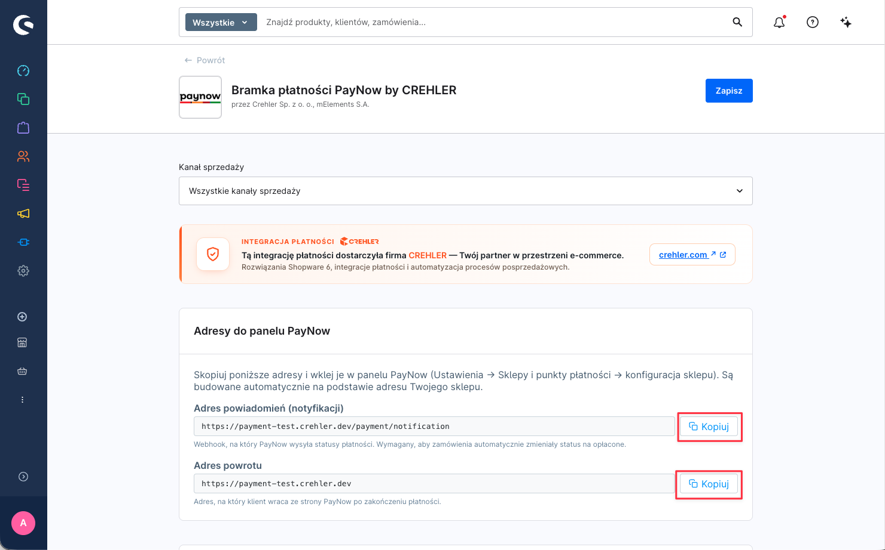

**Jak to zrobić:**

1. W konfiguracji wtyczki (Krok 2), w karcie **„Adresy do panelu PayNow"**, skopiuj oba adresy przyciskiem **„Kopiuj"**.
2. Zaloguj się do panelu PayNow → **Ustawienia → Sklepy i punkty płatności → konfiguracja sklepu**.
3. Wklej **Adres powiadomień** w pole adresu powiadomień/webhooka oraz **Adres powrotu** w pole adresu powrotu. Zapisz w panelu PayNow.

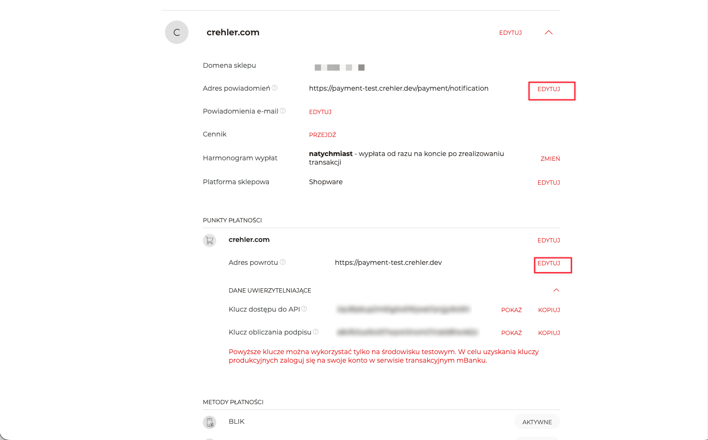

> ⚠️ **Adres powiadomień jest kluczowy.** To na ten webhook PayNow wysyła potwierdzenie płatności — bez poprawnie ustawionego adresu zamówienia **nie zmienią statusu na „Opłacone"**, nawet jeśli klient faktycznie zapłaci.

---

## Krok 4 — Przypisz płatności do kanału sprzedaży

Aby metody PayNow (BLIK, karta, przelew) były widoczne w checkout, muszą być **aktywne** i **przypisane do kanału sprzedaży**.

### 3a. Aktywuj metody płatności

**Ustawienia → Metody płatności** — upewnij się, że metody PayNow są aktywne (przełącznik **„Aktywny"**). Wtyczka dodaje trzy: **Karta**, **BLIK** i **Przelew online** — każda z dopiskiem „… Obsługiwane przez PayNow".

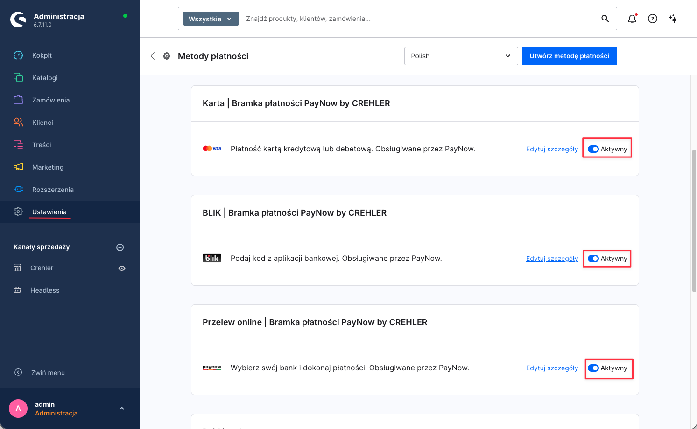

### 3b. Dodaj metody do kanału sprzedaży

W menu po lewej (sekcja **Kanały sprzedaży**) wybierz swój kanał (np. **Crehler**). W sekcji **Płatność i wysyłka** → pole **Metody płatności** dodaj metody PayNow, a w polu **Standardowa metoda płatności** możesz ustawić jedną z nich jako domyślną. Upewnij się też, że **Standardowa waluta** to **Złoty (PLN)**. Zapisz.

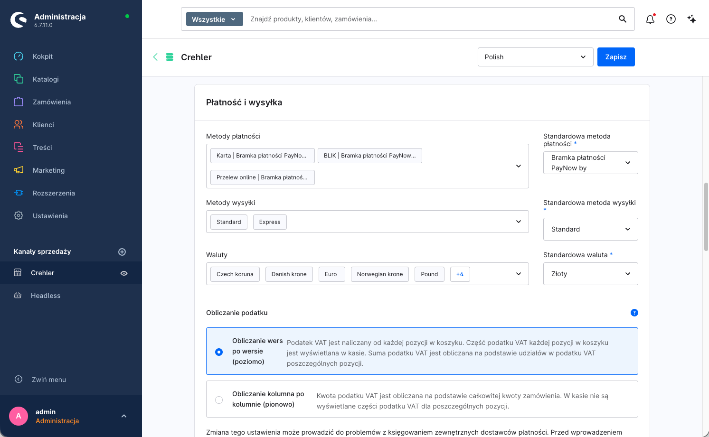

> 💡 Jeśli metoda nie pojawia się w checkout, sprawdź: czy jest aktywna (3a), czy dodana do kanału (3b), czy waluta koszyka to **PLN** oraz czy koszyk/kraj spełnia ewentualne reguły dostępności.

---

## Krok 5 — Konfiguracja płatności kartą

Płatność kartą w PayNow działa w modelu **przekierowania do hostowanej strony PayNow** — klient **wpisuje dane karty (numer, datę, CVC) zawsze na bezpiecznej stronie PayNow**, nigdy w checkout Twojego sklepu. Wtyczka dokłada przy tym do konfiguracji wspólną kartę **Ustawienia wyświetlania**, w której decydujesz o wyglądzie checkoutu.

| Opcja | Działanie | Domyślnie |
|---|---|---|
| **Osadź formularz karty w checkout** | Wł.: w checkout pojawia się sekcja karty PayNow — wybór **zapisanej karty**, opcja **„Zapisz kartę"** i informacja o przekierowaniu. Wył.: klient od razu przechodzi ścieżką przekierowania. **W obu wariantach dane karty wpisywane są na stronie PayNow** — wtyczka nie renderuje pól numeru karty/CVC w sklepie. | Wyłączone |
| **Pozycja pola kodu BLIK** | Gdzie pokazać pole na kod BLIK: *Na stronie potwierdzenia zamówienia* / *Na osobnej stronie po złożeniu* / *Ukryte (przekierowanie do bramki)*. | Na stronie potwierdzenia |

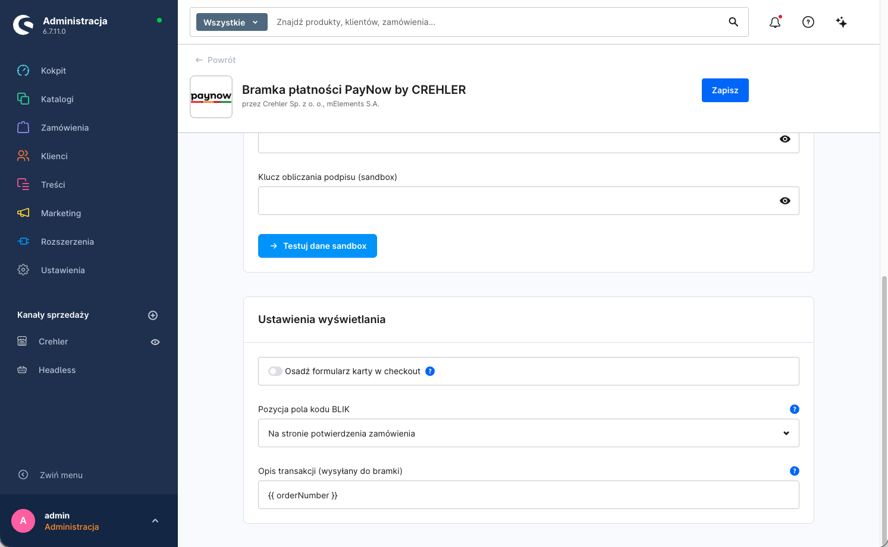

### Jak przebiega płatność kartą

Po kliknięciu **„Zamawiam i płacę"** klient zostaje przekierowany na **bezpieczną stronę PayNow**, gdzie wpisuje dane karty i przechodzi ewentualne **3-D Secure**. Po zakończeniu wraca do sklepu, a status zamówienia aktualizuje się po potwierdzeniu od bramki.

W tle wtyczka ładuje skrypt **FingerprintJS PayNow** (z `static.paynow.pl`), który wylicza identyfikator urządzenia używany przez PayNow do oceny ryzyka/antyfraudu. Skrypt **nie przechwytuje danych karty** — służy wyłącznie identyfikacji urządzenia.

> 🔐 **Zgodność (PCI DSS) — model w pełni hostowany.** Ponieważ dane karty są wpisywane **wyłącznie na stronie PayNow** i nigdy nie trafiają do DOM ani na serwer Twojego sklepu, integracja działa w modelu **w pełni hostowanym** (redirect). To najniższy zakres wymogów PCI DSS — typowo **SAQ A**. W praktyce zadbaj jedynie o to, by sklep działał po **HTTPS**. (To inny model niż osadzony formularz karty renderowany w DOM sklepu, który wymagałby szerszego SAQ A-EP — PayNow tego nie stosuje.)

### Zapisane karty (tokeny)

Jeśli klient zaznaczy **„Zapisz kartę"**, PayNow zapamiętuje kartę jako **token** powiązany z kontem klienta. Przy kolejnych zakupach klient wybiera zapisaną kartę z listy w checkout — płatność nadal finalizuje się po stronie PayNow (token zamiast ponownego wpisywania danych).

---

## Krok 6 — Test płatności

1. Włącz **Tryb sandbox** i zapisz konfigurację (Krok 2b).
2. Dodaj produkt do koszyka (waluta **PLN**) i przejdź do checkout.
3. Wybierz metodę PayNow (np. **BLIK**) i dokończ zamówienie zgodnie z instrukcjami konta testowego PayNow.
4. Sprawdź w panelu Shopware, czy status płatności zamówienia zmienił się na **Opłacone** po potwierdzeniu.

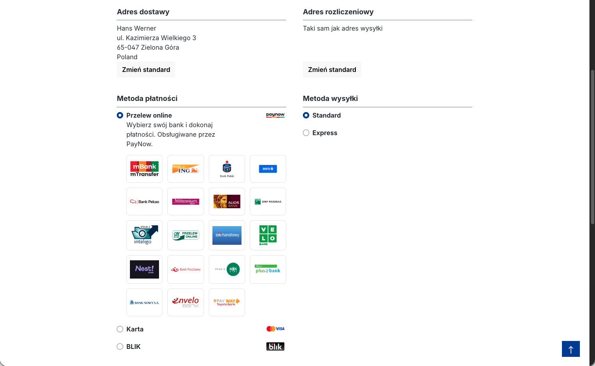

> ↩️ **Zwroty** wykonasz później z poziomu zamówienia w panelu Shopware — pełne lub częściowe, bez logowania do panelu PayNow. Szczegóły: [Zwroty płatności](zwroty.md).

---

## Dane testowe (sandbox)

Środowisko sandbox PayNow pozwala przejść pełną ścieżkę płatności bez realnych pieniędzy. Konto sandbox założysz w **[panel.sandbox.paynow.pl](https://panel.sandbox.paynow.pl/)** (wymaga potwierdzenia adresu e-mail). Status płatności w sandboxie wymuszasz **konkretnym kodem BLIK, numerem karty lub kwotą** — poniżej zestaw scenariuszy.

### BLIK — kody testowe

| Kod BLIK | Wynik |
|---|---|
| `111111` | płatność udana (sukces) |
| `222222` | status **oczekujący** (PENDING) |
| `333333` | odrzucona autoryzacja — nieprawidłowy kod |
| `333334` | odrzucona autoryzacja — kod wygasł |
| `333335` | odrzucona autoryzacja — kod już użyty |
| `333336` | odrzucona autoryzacja — inny błąd |
| `444444` | status **NEW** przez ~20 sekund, następnie **ERROR** (test timeoutu/odpytywania) |

### Karta — numer testowy

| Numer karty | CVV | Data ważności | Wynik |
|---|---|---|---|
| `4444 4444 4444 4000` | `111` | dowolna **przyszła** | płatność udana (SUCCESS) |

### Przelew (pay-by-link)

- **Kwota `9999,99` PLN** wymusza **niepowodzenie** transakcji z komunikatem błędu na stronie płatności.
- Scenariusz działa dla wszystkich metod pay-by-link **z wyjątkiem mTransfer**.

> ℹ️ Dane testowe pochodzą z oficjalnej dokumentacji PayNow i mogą się zmieniać. Aktualną, pełną listę znajdziesz na **[faq.paynow.pl → Środowisko sandbox](https://faq.paynow.pl/docs/srodowisko-sandbox)**.

> ⚠️ Po testach **wyłącz tryb sandbox** w konfiguracji wtyczki (i ewentualny tryb testowy w panelu PayNow), aby płatności produkcyjne były realizowane poprawnie.

---

## Powiązane artykuły

- **[Integracja przez Store API (headless)](store-api.md)** — endpointy Store API (BLIK Level 0, sub-metody banków, sprawdzanie statusu) i przykłady użycia.
- **[Zwroty płatności](zwroty.md)** — pełne i częściowe zwroty z poziomu panelu Shopware.

---

## Wsparcie

Masz pytanie lub problem z konfiguracją? Napisz do nas: **[support@crehler.com](mailto:support@crehler.com)**

Bramka płatności <strong>PayNow</strong> · <a href="https://crehler.com/">crehler.com</a>

